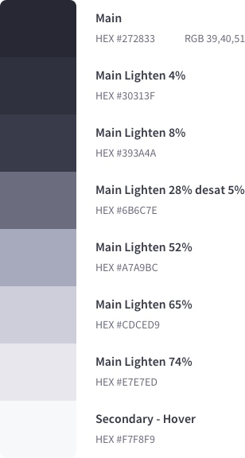
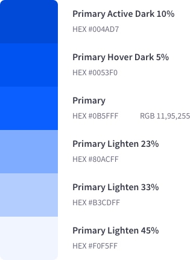
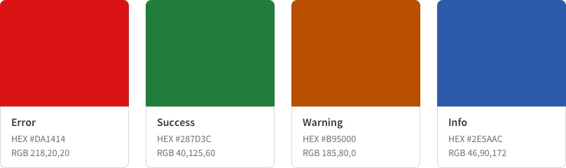
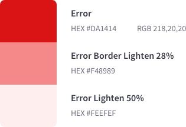
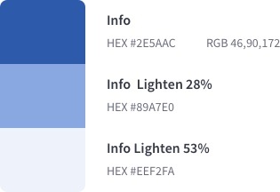

{$page.description}

Colors have a huge impact in a system as they define the visual identity, they bring harmony, they communicate, among other characteristics. Lexicon defines the following color palette that you are free to change for your own.

### Primary colors
Primary colors define part of the visual identity of Lexicon as a system. These colors have been carefully thought to be easily combined and be sure that accessibility is well covered.

| Color | Code | Usage |
| ----- | ---- | ----- |
| Main | #272833 | Texts/icons, navigation background, borders and dividers. |
| Primary | #0B5FFF | Main actions like primary buttons, links, hover and active. |
| White | #FFFFFF | Cards background, toolbar background, modals, forms and texts/icons. |
| Light | #F1F2F5 | Main background of the application, input’s backgrounds and active state in the secondary botton. |

#### Main color variations

| Color | Code | Usage |
| ----- | ---- | ----- |
| Main | #272833 | First level navigation background and primary texts. |
| Main Lighten 4% | #30313F | Second level navigation background. |
| Main Lighten 8% | #393A4A | Third level navigation background and active state on navigation. | 
| Main Lighten 28% desat 5% | #6B6C7E | Secondary texts. | 
| Main Lighten 52% | #A7A9BC | Disabled texts. | 
| Main Lighten 65% | #CDCED9 | Border for clickable elements like buttons. |
| Main Lighten 74% | #E7E7ED | Disabled Background and Border for dividers. |
| Secondary Hover | #F7F8F9 | Hover State for the Secondary button. |

#### Primary blue color variations

| Color | Code | Usage |
| ----- | ---- | ----- |
| Primary Darken 10%| #004AD7 | Active button and links color. |
| Primary Darken 5% | #0053f0 | Hover button and links color. |
| Primary | #0B5FFF | Main action and links. |
| Primary Lighten 23% | #80ACFF | Links on the navigation section. |
| Primary Lighten 33% | #B3CDFF | Disabled background. | 
| Primary Lighten 45% | #F0F5FF | Hover and active background in tables and lists. | 

### Secondary colors

Secondary colors are frequently used colors, also important as primary but do not define the visual identity in a stronger way as Primary colors do.

A closer definition of each color, its variations and usage:

| Color | Code | Usage |
| ----- | ---- | ----- |
| Error | #DA1414 | Text color in error messages. |
| Error Lighten 28% | #F48989 | Border color in error status messages. |
| Error Lighten 50% | #FEEFEF | Background color in error status messages. |

| Color | Code | Usage |
| ----- | ---- | ----- |
| Success | #287D3C | Text color in success messages. | 
| Success Lighten 35% | #5ACA75 | Border color in success status messages. | 
| Success Lighten 63% | #EDE79F0 | Background color in success messages like alerts. | 

| Color | Code | Usage |
| ----- | ---- | ----- |
| Warning | #B95000 | Text color in warning messages. | 
| Warning Lighten 25% | #FF8F39 | Border color in warning messages like alerts. |
| Warning Lighten 60% | #FFF4EC | Background color in warning messages like alerts. |

| Color | Code | Usage |
| ----- | ---- | ----- |
| Info | #2E5AAC | Text color in error messages. |
| Info Lighten 28% | #89A7E0 | Border color in info status messages. |
| Info Lighten 53% | #EEF2FA | Background color in info status messages. |

Last color definition row is used in input fields to reduce the impact of the color saturation in the borders.

### Changing Lexicon color palette

Changing the pre-established color palette is always possible. From Lexicon we understand that our color palette might not fit your needs or requirements as you can have a different corporate image. You just need to set you colors instead of our colors.
