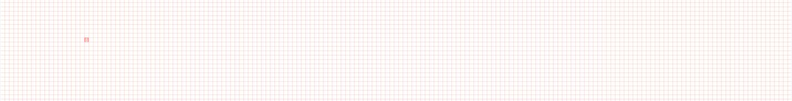
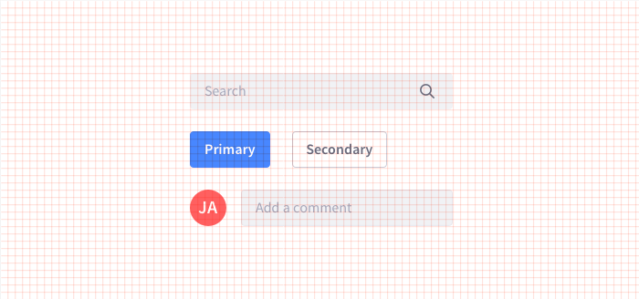
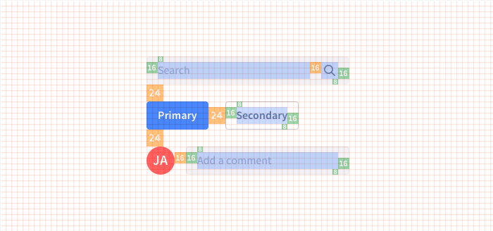
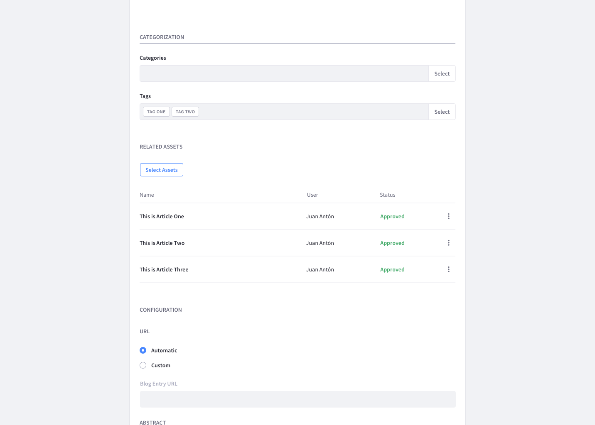
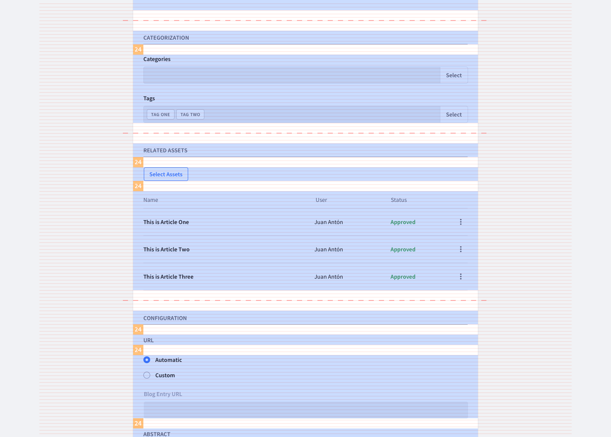
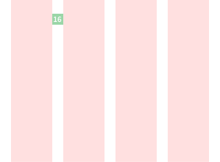
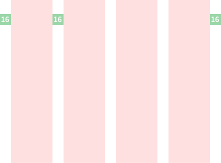
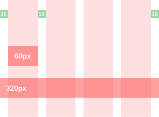

### Description

Lexicon grid is build from the main values of the base font style: 16px font size and 24px (1.5rem) line height.

This line height of 24 px becomes then the reference to define the baseline of the grid.

### Large Viewports

The column system is configured based in 12 columns

The gutter between columns takes the same value of 24px from the baseline.

According to this values, we set the reference container for large viewports to 1248 px width.

This defines a column width of 80 px.

This way, every basic structural element fits on a 8 px base grid.

The 8px module becomes then the main reference for the metrics of the elements, the distances between them and the structures they make up

Then every element of the interface is designed from this 8px grid.

This value of 8 px (and its multiples) becomes the reference value for distances between elements.

And for larger distances between components vertically the main reference value is the baseline value of 24px.

### Small Viewports

The column system is configured based in 4 columns.

The gutter between columns takes the value of 16 px.

The container will have a 16px padding left and right.

The width of the columns will depend on the width of the container.
The width of the container will depend of the width of the viewport of each device
For a viewport of 320px width:

### Sizes and Spaces values

TODO: REVIEW

| Value | Usage |
| ----- | ----- |
| 4px | Exceptional value. used only in margins to adjust distances with line heights |
| 8px | Used as minimum unit and reference value to build all elements |
| 12px | Exceptional value. used only in margins. |
| 16px | Used as general margin size in every container. |
| 24px | Used margin distance between sections in forms. |
| 48px | Used margin distance between sections in forms. |

