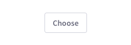

### Description

{$page.description}

### Delete vs Send to Recycle Bin

#### Delete

The action of deleting an element or a set of elements implies that it is not possible to recover them from anywhere and they will disappear forever.

As this is a strong action, you must trigger the user with a confirmation message, always native and not styled by Lexicon.

	

		
		
Do

	

	

		
		
Don't

	

#### Send to Recycle Bin

The action of sending to recycle bin implies that recovering the element is possible. Therefore, it doesn't imply a complete removal of the element.

	

        
		
Do

	

	

		
		
Don't

	

### Done

Use it as the primary button copy in all modal that display a table / list  / card view to select one or several elements.

	

		
		
Do

	

	

		
		
Don't

	

### Select vs Choose

The convention in Lexicon is to use **Select** instead of Choose, as Select is a more formal word.

Select means "to carefully choose"; it also means "to use a mouse or keystrokes to mark something on a computer screen". Therefore, Choose can not have the implication we want on interaction design.

	

		
		
Do

	

	

		
		
Don't

	

