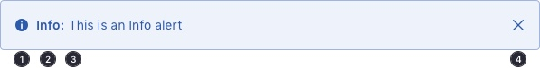
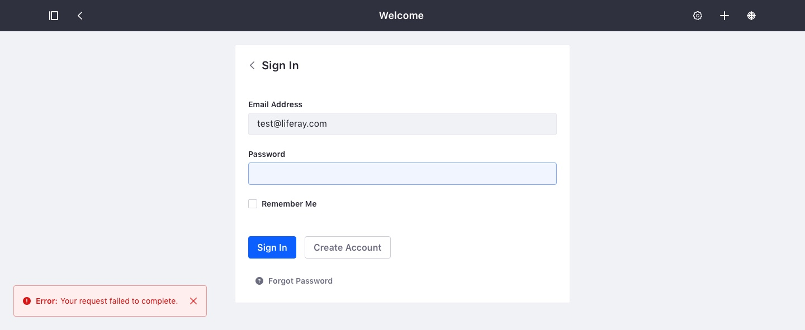
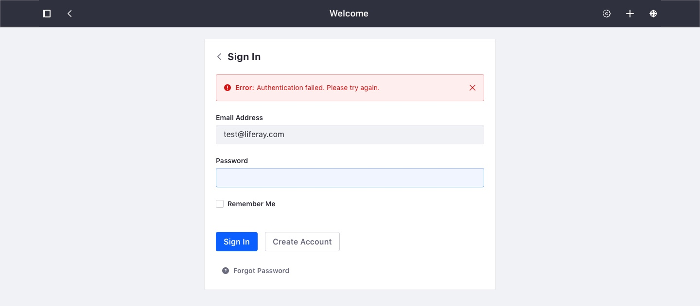

<a class="label-link label label-warning" href="https://clayui.com/docs/components/alerts.html" target="_blank">CLAY</a>

### Description

{$page.description}

### Usage

* Alerts are possible to define in 4 different colors corresponding to status colors.
* Alerts must always have the status icon and the keyword that defines the message type and in semibold.
* Alerts can have multiple text lines.
* All alerts types can contain links. Those links are defined in primary color.
* Alerts can be defined as temporary in the case of toast and stripe. In these cases the delay time is:
    * 10 sec if there are actions associated.
    * 5 sec if there are no actions associated.
    * In both cases the time freezes on hover to allow more time to the user to interact with the alert message. On mouse out the countdown continues.

### Types

| Type | Usage |
| ----- | ----- |
| Error | Red color. This alert indicates that something went wrong after performing an action. (E.g.: Form couldn’t be saved because some data was missing) |
| Success | Green color. Success alert messages will appear when everything was ok. (E.g.: “The user was created successfully”). |
| Warning | Yellow color. This alert lets users know that the action they performed was done but there are some issues with it. (E.g. The item was created but with there were some issues). |
| Information | Blue color. Information alerts are used to inform users about things that occur while they are carry out a task. |

More information about color definitions can be found at [colors page](../designPrinciples/colors.html).

### Attributes

An alert has 4 differnet attributes:
1. The status icon.
2. Type text.
3. Descrition text.
4. Close button. That might appear or not depending on the use you give to the alert in a context.

Please see the following image to understand how an alert is built:

### Variations

#### Toast

This type of alert is specific for toast messages. This type of messages appear on the top right corner of the screen. The maximum width of a toast message is 360px and the height can vary depending on the number of rows. It always have a close action.

This alert type must appear at the bottom left side of the screen. 24px separation from the left and from the bottom. In case they are configured to close automatically, the time will be 10 seconds.

Example of use:

#### Embedded

Embedded alerts are thought to be used inside context as forms. Usually you will only need to use the information one. Its width depends on the container with you use it, always respecting the container margins to the content. The close action is not of mandatory use.

Example of use:

