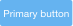

Buttons communicate an action to happen on user interaction.

## Types

| Type | Usage |
| ---- | ----- |
|  | **Primary**: The primary button is always use for the most important actions. There can't be two primery actions together or near by. |
|  | **Secondary**: The default button is used for secondary actions. |
|  | **Link**: The link button is used for tertiary actions or opposite actions to the primary one.  |

## States

**Default state**

**Active & Hover states**

**Disable state**

## Sizes

| Size | Usage |
| ---- | ----- |
|  | **Large**: Used for main page actions like Save or Cancel. |
|  | **Default**: Used for actions inside a page, like dropdowns, button groups, split buttons. |
|  | **Small**: Use it on reduced spaces. |
|  | **Extra small**: Use it in spaces that are very small and not really significant. |

## Variations

### Icon button

Buttons can icons insted of text and for that icons need to be monospaced inside the button. Lexicon do not use buttons with text and icon, or text and loading indicator. Icon buttons are used intensively in [management bars](./management_bar.html).

### Block level button

All buttons can also be configured at block level. Use this configuration in those cases that you need the user to realize there is an important action to be done. It could be used as a load more action below a list, as an example. Please do not use it in forms. Be always careful with the type button to use, primary is not always the best choice neither the only configuration.

### Dropdown button

Dropdown buttons are always used together with a dropdown menu.

### Split button

Split buttons are used in those cases where you need to offer the user a quick main action but salso secondary actions.

### Button group

Button groups are used to switch between complementary views for example but they must never be used for complementary actions and "Change and Cancel" or "Save and Cancel". In those cases the use of single buttons is the correct solution.

### Action button

The action button is always a primary button with a special size of 64x64 due to its importance. This button floats on the bottom right corner of the screen. It contains all the adding or creating actions in a context. When there is only one action to perform in the page where it is used the button triggers the action. In case there are more that one actions, all the actions appear listed in a dropdown panel that is triggered on click interaction with the button. Once selected the action in the list, the dropdown is closed.

