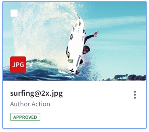
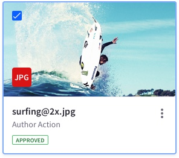
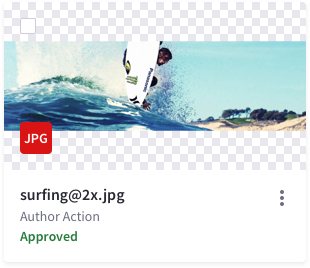
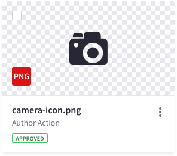
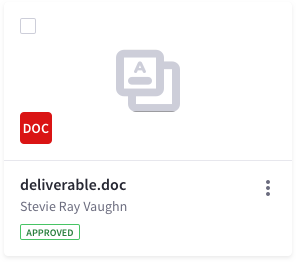

<a class="label-link label label-warning" href="https://clayui.com/docs/components/cards.html" target="_blank">CLAY</a>

### Description

{$page.description}

### Usage
Cards is a pattern that is heavy on image usage, therefore we recommend to use it only if you have images associated to your content. A good example of this could be your users database or an image library.

Cards are not meant to compare information in an exhaustive way but a light way. In case you need exhaustive comparison and not based on image comparison, you must use a table.

Cards in Lexicon are open to many configurations. We provide a flexible card layout for you to configure it as you want. Later on this page we provide a series of examples we use in our systems for you to get inspired.

### Card interaction

* A card can have a checkbox, a radio or none of them.
* Selecting a card is only possible by using the checkbox or radio, and the image area. 
* Main text in the card can be configured to navigate
	* In case of:
		* Folder: it navigates to the next level.
		* File / Image / User: it navigates to its detail view.
	* Do never use it for preview. Preview is always a secondary action placed inside the action menu.
* If the link drives the user out of the site, please identify visually that this link will open in a new page.

### Layout
By providing a flexible layout, Lexicon opens you a wider range of possible configurations for your card. Every element can be used or deleted adapting it to your specific needs in each use case.

As you can see in the following image, a card is shaped by:
* Image area: main element in this pattern. 16:9.
* Checkbox or radio: useful when working together as a visualization type with a management bar.
* Sticker or User image: Useful to identify the file type or the owner.
* Information area
	* Text lines of different importance: relevant information.
	* Actions menu: actions associated to the card

Among these elements, the only one that can't be removed for the pattern meaning is the image.

### Image card

Used in image/document galleries.

#### Default 

#### Hover

#### Active 

#### Empty

#### Image with different ratios

It is important to highlight that images can have different sizes. To provide the end user with that relevant data about the image Lexicon incorporates cards that allow this feature.

### User card

User card is used to represent users. The user can be represented by its user image or up to two initials extracted from the uses name or name + surname. 

### File card

File card is used to represent files different to images.

### Folder card

This card variation is meant to have horizontal representations of information. This card has the same amount of elements as the previous explained. The main purpose of this card is to represent folders, therefore we allow to remove the image in this card type. In this case, only the checkbox is used to select.

### Sections
Card sections help to separate different contents by a certain categorization or typology.

### Examples of use

Examples can be found in [dataset template](./Templates/datasetTemplate.html).

