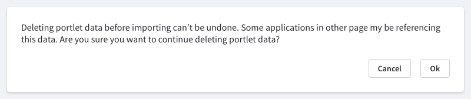

### Description

{$page.description}

### Usage

#### When to use it

There are two main use categories that helps you to identify the correct situations to use confirmation messages:
* Risk action: The action the user is going to perform has significant consequences that cannot be undone or easily undone. Ex: site deletion.
* Unintended consequence: There is an important side effect on the action the user is taking that most probably will make her feel lost. Ex: Site switch, where there is a complete change of context including user permissions.

It is very important to use this pattern only when it is needed as it is a very intrusive pattern, so take a time to think if your case is included in the previous set. This message type should be rarely needed in the system.

#### When must not use it

* Error prevention: put first the effort on your interface to guide the user on what is going to happen. Clear copy’s prevent the usage of confirmation messages.
* Feedback: providing extremely clear feedback can prevent the usage on confirmation messages.
* Undo actions: if action has an undo action you must never use a confirmation message. A clear example is “Move to Recycle Bin”.
* Don’t use it if it is not really needed.

#### How to write a confirmation message
Writing a good confirmation message is relevant to make it really effective in such exclusive situation:
* Do not write generic and open questions. Ex: Are you sure?
* Be clear and concise.
* Provide exact data to your user so there is no uncertainty on the action to be confirmed.
* Address your questions and statements so they can be easily answered with "Ok" and "Cancel" as they are forced by the browser.

### Implementation
Confirmation messages are browser native. Therefore Lexicon does not style them. Browser native confirmation messages are accessible, and work perfectly in every device.
