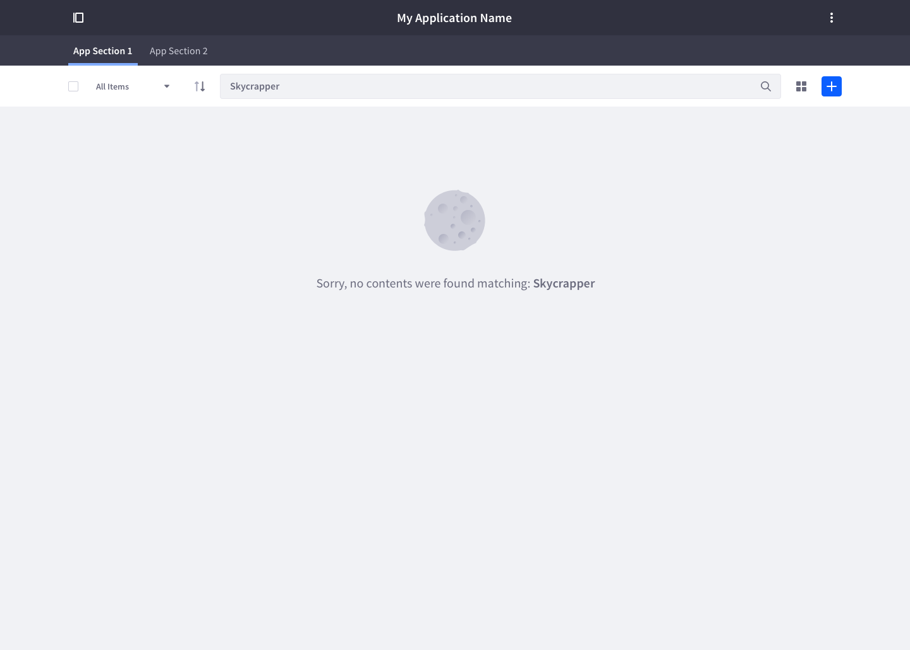
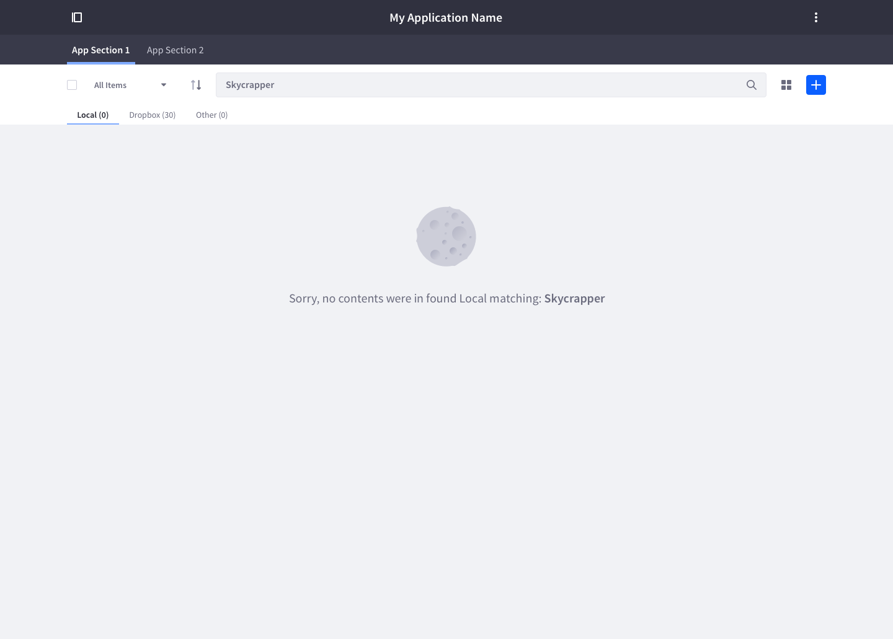

### Description

A dataset display is the combination of a [management bar](./management_bar.html) with one or many data visualization types and a possible mechanism of pagination. The most common visualization types used are [table](./table.html), [list](./list.html) and [card](./card.html).

### Usage
This pattern is used when the elements of the visualization require collective management, therefore the management bar becomes important as it facilitates tools needed to work with the dataset.

* This pattern can be only used one time in a page.
* Use it is you want to have several visualizations for a set of data.
* Use it if you want to perform actions over the data at individual level or group level.
* Only use the needed visualizations. Not all visualizations are appropriate for all data types.
* When the result of a filter is an empty result, the filter must be possible to be changed to another filter not blocking the management bar usage. Always offer a descriptive message on empty datasets due to no elements or no match in the search.

#### Use a list view
* If you need to display a homogeneous sets of basic data.
* If you need to sort, group, or filter simple data sets.
* If you don’t need to compare between attributes of different items.
* If you need to display a single-level hierarchy.
* If you need to provide a quick identification of the basic content of a list item at a glance.

#### Use a table view
* If you need to manage complex data sets that need to be extensively sorted, grouped, filtered, or edited..
* If you need to compare between attributes of different items.
* If you work with complex hierarchies.

#### Use a grid view
* If the primary content consists on images.
 
#### Use of other visualization methods
* Other visualization methods are also possible, such as map view, but you will have to implement it by yourself as it is not the most common case we have in our platform.

### Empty state

It is important to let the user know what happens in empty states and let them know what has happened and how to perform actions to move out from that empty state.

#### Empty dataset

This is the initial state for a dataset without elements. The formula for the message is:
* Application collection is empty. Please, add elements.
	* Example: *Web Content collection is empty. Please, add elements.*

As stated in the previous case, it is important to help the user understanding what happens in empty states. Please follow this formula for expressing the empty search result:
* No [document type] were found matching with: **query**.
	* Example: *No web contents were found matching: **water***

In case this result could be inside a repository as is the case of Documents and Media, follow:
* Sorry, no [document type] were found [in repository] matching with: **query**.
	* Example: *No documents were found in Local matching: **water***

### Individual actions

Individual actions are all those actions that an element has. This actions are always possible to reach from the element itself through the actions menu. Some of this actions are also placed in the management bar when only one element fromt the dataset is selected. These actions are always represented by a metaphor, , they are buttons with icon. Only those actions that can be easily represented by an icon will be there. Not all possible represented by an icon must be there, only the ones considered as more relevant.

### Collective actions

Collective actions are shown in the management bar when more than one element is selected in the dataset. In case there are  collective actions that don't have an icon representation the can be placed in a dropdown triggered from the actions button.

### Filtering
* Use filter only when you need them.
* When a filter is applied from the management bar to a visualization type, the visualization type itself needs to update to show the specific data requested by the user.
* A user is only able to filter by the elements that are displayed. Hidden elements can not be used for filtering as they must not appear among the filtering options.
* When the result of a filter is an empty result, the filter must be possible to be changed to another filter not blocking the management bar usage.
 
### Sorting
When sorting is applied from the management bar to a visualization type, the visualization type itself needs to update to show the specific data requested by the user.
* A user is only able to sort by the elements that are displayed. Hidden elements can be used for sorting as they must not appear among the sorting options.
* Tables are able to show the sorting applied in the column header. This update must be done in both ways:
	* When the user sorts using the column header the value must be marked on the sort panel and the arrow must indicate the “sort direction”.
	* When the user sorts using the sort panel and button, the action must be reflected in the appropriate column header.
 
### Selection
When an item is selected in any of the views the management bar must change state 2. This state has a different background color so the user can notice the change. Depending on the number of items selected in the visualization, the number of actions adapt.
* One item selected: The available actions are the same as in the row.
* More than one item selected: The available actions are the ones that apply to the group.
The check box in the management bar selects/unselects all elements in the visualization.

### Drag and drop example
TODO

### Breakpoints

Please visit this [InVision](https://liferay.invisionapp.com/share/VHD8PYBEZ) to see the breakpoint definition for the dataset displays.