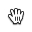

{$page.description}

### Events

Drag and drop interaction is composed by a series of events that are translated into the code.

* **DragStart:** Click or Tap with Holding and Moving the pointer will start the drag of the element.
* **Drag:** The element is being dragged.
* **DragLeave:** The element leaves its original position or a valid target.
* **DragEnter:** The element enters a valid drop target.
* **Drop:** The element is released in a valid or not valid target.
* **DragEnd:** The result of the drop action. Successful if it matches the conditions for drop target.

### Actors

#### Pointer
An interface element to take care about in this interaction is the pointer when using pointing devices as a mouse. Please follow the guide:

| Type | Usage |
| --- | ---- |
|  | **Default:** the standard mouse cursor. |
|  | **Open hand:** you can use it with the hover state of an element when is possible to move it around and the selection is not allowed (possible examples: a map, a zoomed image). |
|  | **Dragging:** Always required as feedback for the dragging action when using a mouse. |

#### Handler
A dragable element can be difficult to identify in the interface. To improve the affordance of these elements we encourage you to user the drag-dots icon in the component on hover.

A good example can be found in a list where the list items are draggable.

#### Drag Element & Drag Feedback
Elemnents that are draggable must offer a feedback also when these elements are being dragged.

**Resize item while dragging**

When dragging a single element, this must resize a 70% and accompany the cursor as presented in the following image.

**Multiple elements dragging**

Dragging multiple elements may require inform the user about how many elements are being dragged. For that we offer a badge to reflect this amount.

* The badge must always be placed at the top-right from the cursor.
* The multiple selection will be previewed together with the grabbed element and while moving it.

#### Drag Source
There are two variants to show feedback in the drag source.
* Setting its opacity to 40%.
    
    

* In some cases it could be necessary to simplify the drag source feedback, for those cases you can use a placeholder using the same size of the element. The background color gets #272833 with 4% opacity. This might require to be adapted depending on the use case.
    
    

The drag source is the original position of the dragged element and it will be visible when the Drag Element is being dragged away from its Drag Source (event: DragLeave). 
The default style for the drag source will display a copy of the Drag Element setting the opacity at 40%. 

#### Valid Target
A Valid Target is the possible drop area of an element, used as destination of the Drag Element. There could also be multiple Valid Targets in the same page and the user can decide where to drop the Drag Element.

**Default: No interaction**

The default the valid target will use a grey background and a grey dashed border.
* This can be used in scenarios where files need to be dragged.
* Please use text inside to improve the affordance.
 

**DragEnter: Dragging Interaction**

Dragging an element into a valid target area activates the target area. In this case you must respect the border line style but make it blue as show in the image.

**Drop and DropEnd: Dropping Result**

After dropping the Drag Element inside the Valid Target it will trigger the Drop and DropEnd event.

**Dropping result on cards sorting**

You can use the Drop/DragEnd event to magnetize the Drag Element to the Valid Target, this will improve the accuracy of the drag and drop action when the element changes position in the same page.

**Dropping result on move elements to folder**

Moving the Drag Element into another element to change its location (like a folder) will trigger an animation with a border that expands and hides. This helps as feedback for the dropped element. 
It is also recommended to show a success alert after the action is done, this will the user know that the elements were move correctly and give the possibility to undo the action using a link.

**Dropping result on list sort**

Another way to define a valid target is to use a blue line of 4px between the elements.
We recommend to use fluid animations to generate a more natural feedback of moving around elements.

