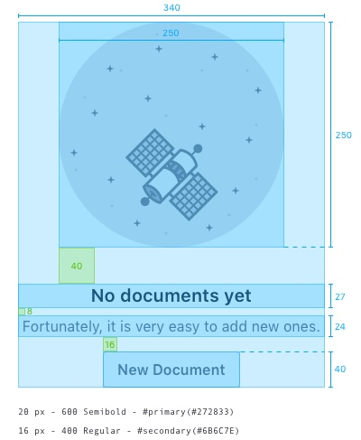

PORTAL

### Description

{$page.description}

### Usage

#### What animation to use and when?

Several animations are created to cover different scenarios. Right now there are 3 different [animations](../designPrinciples/animations.html) and here we can see them used in different contexts.

**Empty dataset:** there are no elements in the data set at a certain level

**Empty search results:** filters applied or search result provides 0 results

**Empty state for success:** the user has emptied the dataset for a good end. Removed all notifications. Get to a clean state.

#### When to not use the animation?

Animations are used to catch the user attention. Therefore, animations are intended to appear only once in the screen and not multiple times. In our case we want these animations to also be in the wide components that are usually the main focus of attention. On narrow areas we prefer to be more discrete and to avoid the animation.

### Attributes

#### Inside a dataset display

1. Animation
2. Text:limited to 1 line
3. Message: limited but we recommend to use a maximum of 30 words.
	* Do not make messages personal unless they work on favor to the user.
	* Do not leave one word alone in a line.
	* Do not use your.
	* Do not use exclamation marks.
	* Use common language and not jargon.
4. Button: secondary button

The margin from the container to the top element will be of 80px

#### Outside a dataset display

In this case we are in an area that is tiny and we won't use an animation. To counteract the lack of animation we use the primary button to cacth the eye attention.
1. Text: limited to 1 line
2. Message: as in the previous case
3. Button: primary small button.

