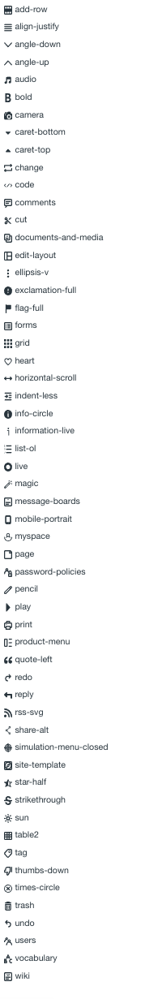

Icon is a visual metaphor representing a concept that lies behind the idea and/or action.

## Liferay icon library

Liferay has its own icon library created for the porpuses of the projects that use Lexicon. You can also use other icon libraries. [Check our icon library](http://liferay.github.io/lexicon/content/icons-lexicon/).

### Language flags

People tend to have pretty strong opinions on whether flags should be used as a visual cue for indicating a language, mainly because in many parts of the world, the flag may have cultural and geographic meanings that we might not be aware of, or the flag itself isn't fully accurate to the dialects spoken in that region.

While we understand that reasoning, we've found that the times they are actually needed (when a user is not familiar with the currently displayed language) somewhat eliminates using other mechanisms, such as the name of the language (since the current language could be in an entirely different character set). Given this, there is often at least some familiarity with the identity of a country that speaks a shared language. [Check our flags library](http://liferay.github.io/lexicon/content/icons-lexicon/).

### Other icon libraries

[Font Awesome](http://fontawesome.io/) and [Glyphicons](http://glyphicons.com/) are good alternatives in case you don't want to use Lexicon icon library.

## Usage

Icons can be used only when the metaphor is direct and clear. In case there is not a good icon to represent the concept you want to transmit, it will probably better to use words. Icons must be reserved to broad accepted visual ideas.

### Why do we use SVG?

SVG gives us and you a greater amount of freedom in styling the icons, as well as a higher level of fidelity and clarity in the icons. Font icons, while fairly simple, also suffer some drawbacks, mainly with sub-pixel aliasing that cause the quality to not be as high as we would like. Also SVG allows for multi-color icons.

### Help icon

Help icon is used in lexicon together with tooltips or popovers. As an example, it gives a better visual clue to users to reach an explanation about a field in a form.

### Sizes

| Size | Usage |
| ---- | ----- |
| Icon-large | Icon-large (x1.33) |
| Icon-2x | Icon-2x (x2) |
| Icon-3x | Icon-3x (x3) |
| Icon-4x | Icon-4x (x4) |
| Icon-5x | Icon-5x (x5) |
| Icon-2x | Icon-2x (x2) |

