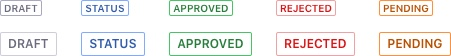
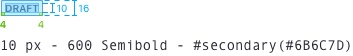

{$page.description}

### Usage
Use labels to organize groups of items in your application. Labels have rounded borders by default.

### Sizes

| Size | Usage |
| ---- | ----- |
|  | **Small**: Use it in contexts where its relevante is not major. Use it always in capital letters. |
|  | **Default**: Use it for marking states. The use of lowercase is valid in this option|

### Do's and Don'ts

Labels can't be used together with badges.

	

		
		
Do

	

	

		
		
Don't

	

Labels can only have only line of text displaying the entire content.

	

		
		
Do

	

	

		
		
Don't

	

Labels never allow ellipis.

	

		
		
Do

	

	

		
		
Don't

	

### Variations

#### Label simple

Used to identify, tag content, show status, to filter content or even to provide navigation to elements of same identification. It can be used with status colors.

#### Label removable

Used in filter bars, categories, etc. Always in default size and without status color. Use it only in default size.

#### Label with link

Used in sites to link to related content.

### Attributes

Small size metrics:

Default size metrics:

