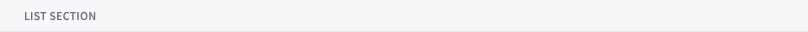
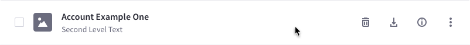
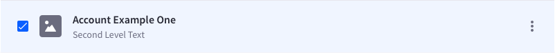
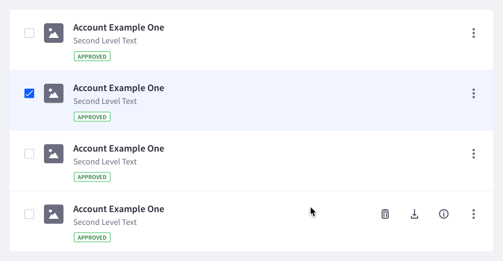

### Introduction

{$page.description}

### Usage

A list view is useful for comparing entries among them that do not need exhaustive comparison. In case you need exhaustive comparison use the table view.

A list allows you a free way of displaying information. While the table isn't meant to have several text labels in a column, list is the pattern for doing that, as you can see in the following examples.

Not all the element in a list entry are mandatory, feel free to delete and include the ones you need.

When a list is used together with management bar, the list entries must include the checkbox, as the selection and actions are reflected in the management bar.

### List group

Whenever you need to group series of list entries, you can use the list group separator.

### Row states

#### Default states

#### Hover state

#### Selected state

### Row interactions

* A list entry can have a checkbox, a radio button or none of them.
* Selecting a row is only possible by using the checkbox or radio button depending on the selection type desired in the list. An interaction with the background does not produce row selection.
* Text elements in the row can be configured as links to navigate.
* A row can have none or several actions associated. When there is only one action and it can be represented by an icon, you don't need to make use of the actions menu. Otherwise, use the actions menu on the right side of the row.
* The main text is usually used as an action:
	* In case of:
		* Folder: it navigates to the next level.
		* File: it navigates to its detail view.
	* Do never use it for preview. Preview is always a secondary action placed in the row action menu.
* If the link drives the user out of the site, please identify visually that this link will open in a new page.

### Content format and aligment

* Main text must be always in semibold.

### Sections
List sections help to separate different contents by a certain categorization or typology.

### Row Attributes

TODO:

#### Example of use

More examples can be found in [dataset template](./Templates/datasetTemplate.html).

#### Example

Please visit [inVision](https://liferay.invisionapp.com/share/YAAFKJ4WN) example to visually understand the behaviours.

### Mobile

#### Example

Please visit [inVision](https://liferay.invisionapp.com/share/HEAGTZBRV) example to visually understand the behaviours.
