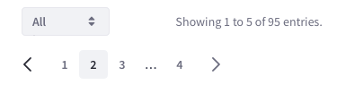

### Description

{$page.description}

### Variations

#### Pagination

Use it when you need a simple pagination pattern that does not require to change the page size.

Pagination includes several mechanisims to move between pages:
* Left arrow:
    * Navigates backward 1 page.
    * Disbled when the first page is selected.
* Numbers: redirects directly to a certain dataset chunk calculated with the page size.
* Ellipsis:
    * It appears when the number of pages exceeds 6.
    * It shows a dropdown menu with the rest of the pages.
    * It is always shown in a middle possition.
 * Right arrow:
    * Navigates forward 1 page.
    * Disbled when the last page is selected. 

Pagination can also have buttons to jump directly to the first page and to the last page.

TODO:
* Review arrow style as this is navigation
* Review double arrow

#### Pagination bar

A pagination bar is pagination with additional functionality. This added functionality comes with a page size selector placed on the left size of the bar. To the right side we incorporate a label to provide feedback on the exact chunk of information displayed from the dataset. On the right side of the pagination bar there is the classic pagination that adapts depending on the number of pages.

Use it when you need a complex pagination pattern that requires changing the page size and recalculating the number of pages. This pattern gives feedback about the chunk of dataset you are viewing.

Interactive components:
* Entries dropdown: to select the number of elements per page. You can configure you page size options.
* Arrows: to move to previous or next page.
* Ellipsis: to select intermediate pages not possible to see due to the number of pages through a dropdown menu.

##### Pagination bar mobile

### Attributes

TODO: