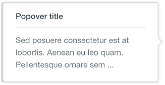

# Popovers

Popovers are short helpful and/or descriptive pieces of information that appear on hover state.

 
 
 
 

## Usage

Popovers are used together with the question mark icon as an affordance to let the user understand there is something to read that can be useful. Popovers contain information such as help to understand a context.

# Tooltips

Tooltips are brief pieces of information that appear on hover state over an element to clarify the meaning or use of an interaction element for the user.

 

## Usage

Tooltips are used in with icon buttons to help understanding the metaphor they transmit.
They can be also used with links or images.

The tooltip appears on hover state and disappears when hover ends. This pattern does not exist in mobile a hover is not a possible state.

Please make a right use of the arrow positioning as it could drive to misunderstandings when it doesn’t point to the correct interface element.