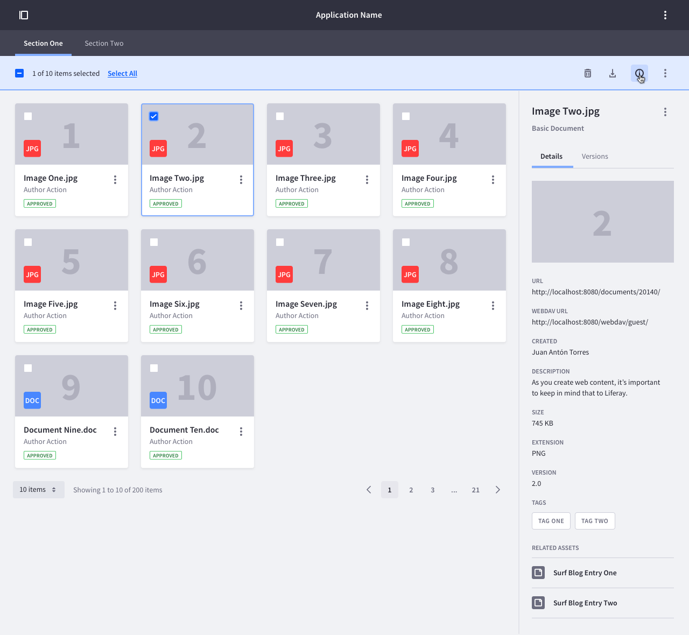

### Description

{$page.description}

### Usage

Sidebar is basically an information container where to display information relevant information that does not fit into the table, list, card or any other visualization. This information can be of the type you want. Usually it is used to show detail information of an element without navigating deeper in the navigation hierarchy.

On multiple selection, this panel shows the last selected item.

 

Sidebar is pretty similar in mobile, but it covers the complete height of the screen. A tap in the shadowed area closes the side bar.

 

