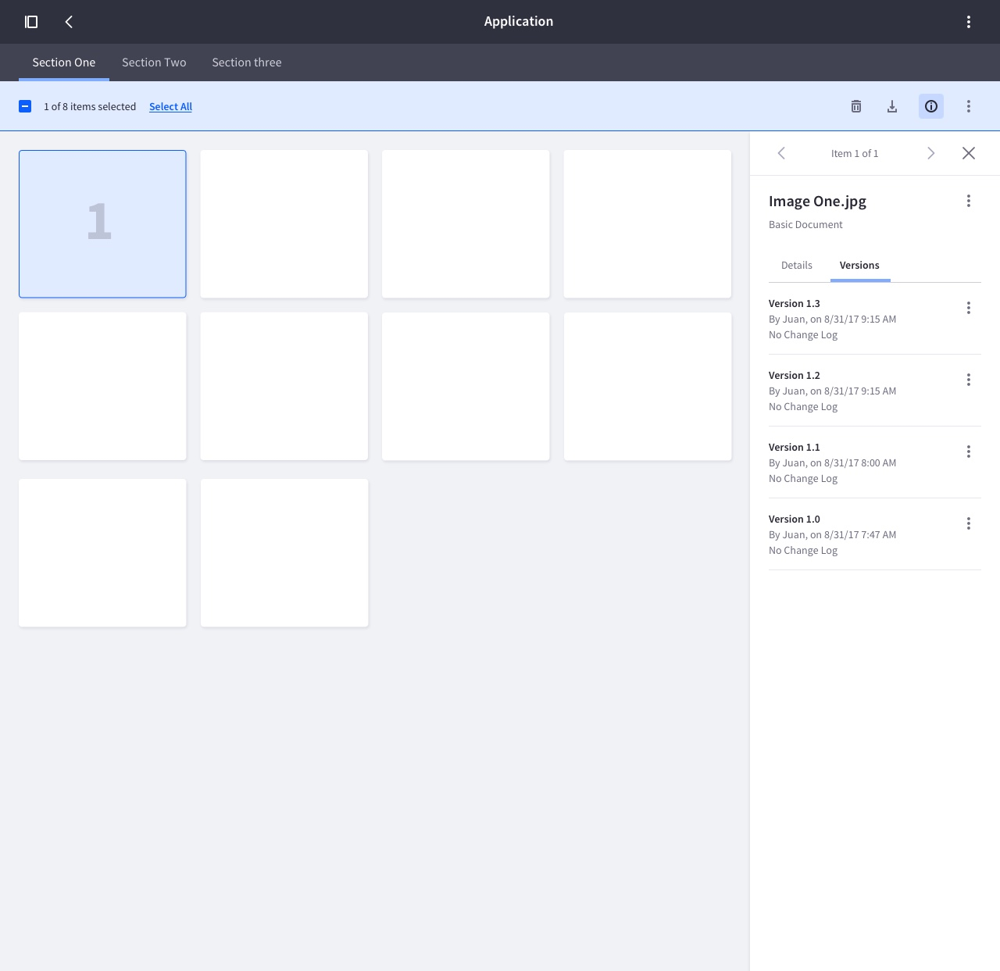
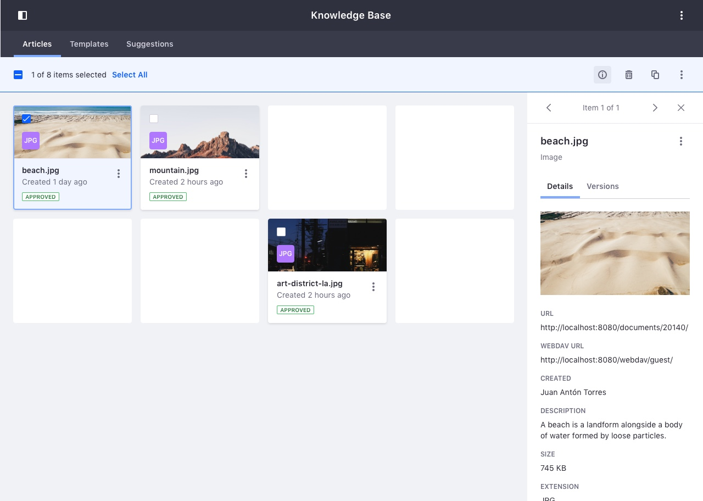
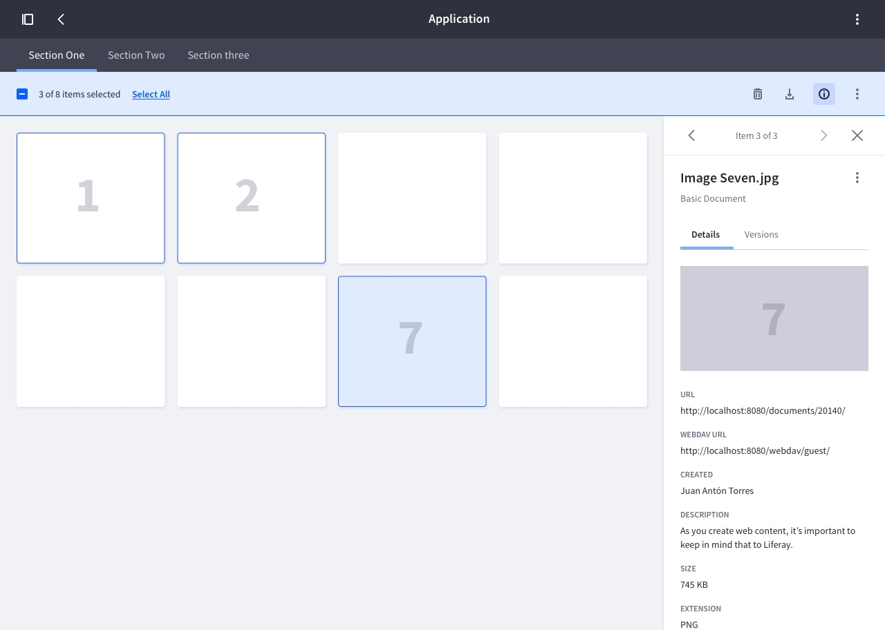
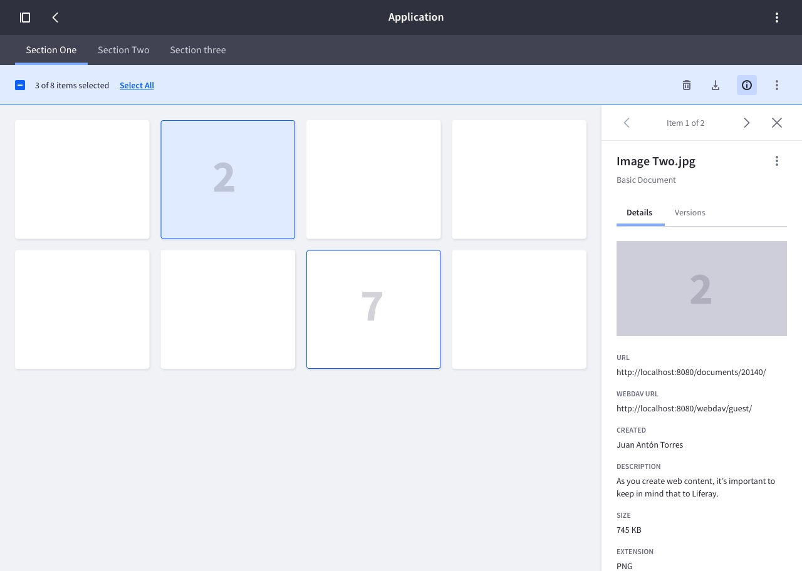

### Description

{$page.description}

Sidebar is basically an information container where to display relevant information that does not fit into the table, list, card or any other visualization. This information can be the type you want. Usually it is used to show detail information of an element without navigating deeper in the navigation hierarchy.

### Visual Description
This sidebar appears always from the right side of the viewport and pushes the container in large viewports and slides over it in small viewports. See responsive behavior for more details.

In these two images belong to a “Documents and Media” application case as a visual example.

 

 

#### Components

The components used in the “Info Panel” can vary depending on the application. Following the same example used above, this images show the components used on the “Documents and Media” application.

 

#### Sidebar Height
The sidebar always adjusts to the maximum height of the viewport extending the white background color as much as necessary. 

 

 

 

### Item Selection and Navigation

#### Single item selection
The information of the item is displayed in the sidebar.

 

#### Multiple item selection
The information of the last selected item is displayed in the sidebar.

 

If you deselect one item, the info of the following numeric item will be shown on the Sidebar Info Panel.

 

 

#### Item Carousel

When there is more than one selected items, you can browse the information of each of them using a carousel element located on the top of the panel.

 

### Responsive Behavior

In these examples we show the behavior of the “Info Panel” in different viewport sizes based on the established breakpoints.

We have also included the behavior in cases where the bar is visible at the same time as the “Product Menu”. 

All of these examples also show how the grid of cards would behave in each of the cases.

#### No Sidebar Opened

 

#### Info Panel opened
In viewport sizes under 768px width, the “Info Panel” slides over the container instead of pushing it.

 

#### Product Menu + Info Panel

In viewport sizes under 768px width, the “Product Menu” slides over the container instead of pushing it.

In viewport sizes under 992px width, the “Info Panel” slides over the container instead of pushing it.

 
