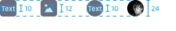
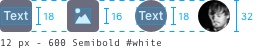
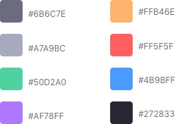
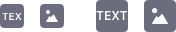
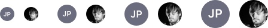

<a class="label-link label label-warning" href="https://clayui.com/docs/components/stickers.html" target="_blank">CLAY</a>

### Description

{$page.description}

### Usage
Use stickers to visually identify elements in a dataset that are part of a same group. You can use any color you want for stickers.

### Sizes

#### 24px

Use it in smaller contexts where you only need visual identification but not manual interaction with this element.

#### 32px

Use it in cards that are image based, allowing to see more parts of the image.

#### 40px

Use it in sites to identify the user in a comment in comments portlet. Only rounded.

#### 48px

Use it in sites to identify the user in a blog entry or article. Only rounded.

### Colors
Stickers can have any possible color.
There default color for stickers is: Main Lighten 28% desat 5%, that corresponds to #6B6C7E

### Variations

#### Square

Use it only with files and folders. You can place up to 3 characters inside it or an icon. Always capital letters.

#### Round

Use it only with people. You can places up to 2 characters inside it or an image. Always capital letters.

### Position
A sticker can be placed in a Image Card. Its position is always bottom left as you can see in the following example.

