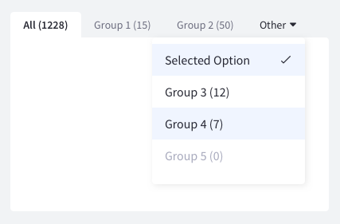
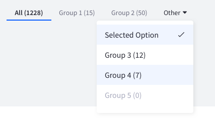

{$page.description}

### Usage

* Use tabs when you need to move between views on the same context.
* Split your information into groups that are easy to identify by your end users.
* Order your tabs in a natural way for your users.
* Tabs are meant to be used when you don’t need to compare contents.
* All tabs in a tab bar must follow the same style and type. Changing styles in tabs can produce the feeling of navigation and this is not the desired outcome for this pattern.
* A tab must change to selected state on user selection. It must be easy to identify among other tabs. There can only be one tab selected at same time. The rest of the tabs must be possible to read.
* Tab label must be short, maximum two words, clear and concise.
* Do not use all caps in the label, this complicates the readability of the tab.
* One of the tabs must be always pre selected
* Tabs must collapse below "More" tab when the don't fit in the screen. More dropdown tab can exist if the tabs fit in the available width. This tab will be always the last one.

### Variations

#### Classic tab
Use this tab type inside forms.

#### Modern tab
Use this tab type together with dataset visualizations as the list view or card view.

